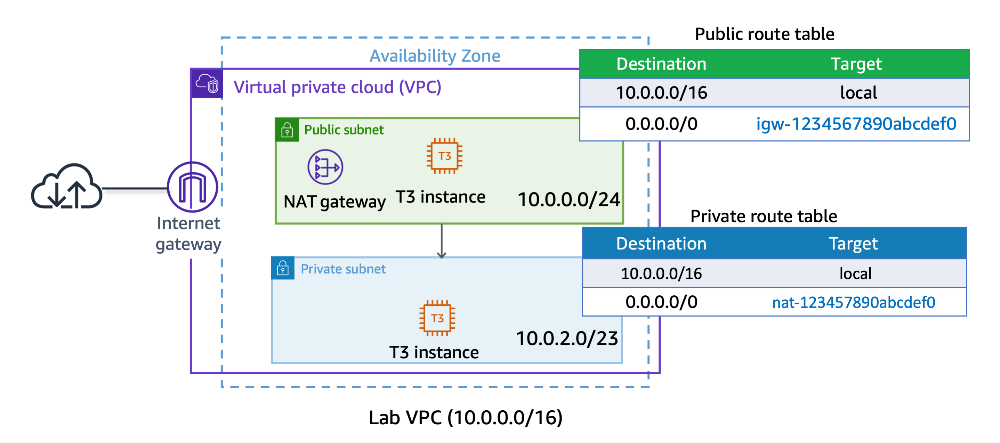
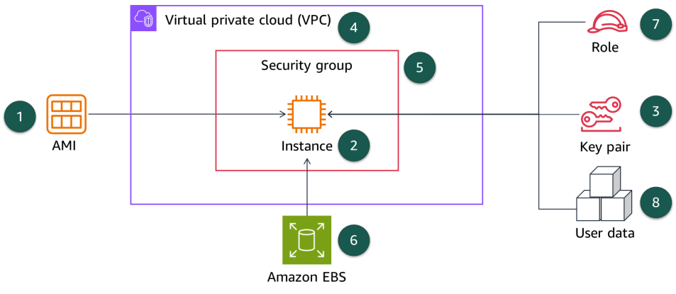
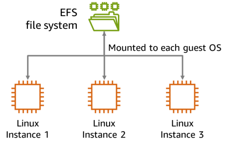
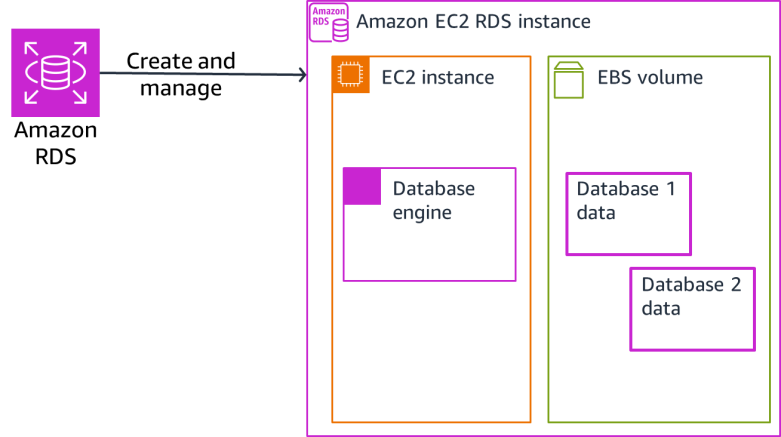
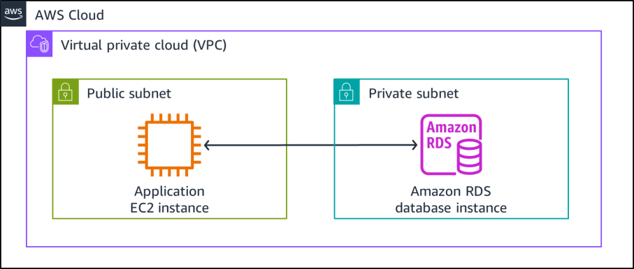
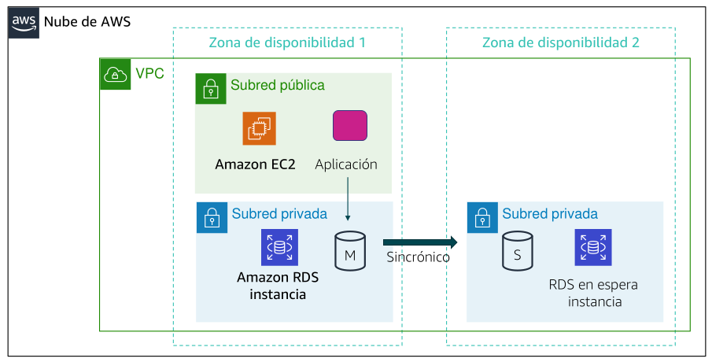
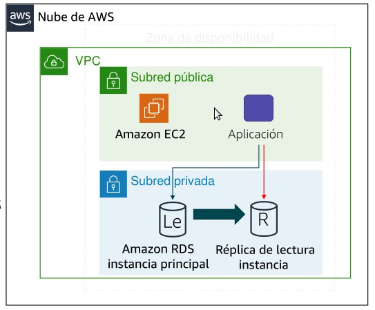

RESUMEN DE CLOUD COMPUTING Y AWS
================================

Este es mi resumen sobre cloud computing y AWS.


Tabla de contenido:

  * [EL CURSO AWS CLOUD FOUNDATION](#el-curso-aws-cloud-foundation)
  * [CONCEPTOS DE LA NUBE](#conceptos-de-la-nube)
  * [PRECIOS Y FACTURACIÓN](#precios-y-facturación)
  * [INFRAESTRUCTURA GLOBAL](#infraestructura-global)
  * [SEGURIDAD](#seguridad)
  * [REDES](#redes)
  * [CÓMPUTO](#cómputo)
  * [ALMACENAMIENTO](#almacenamiento)
  * [BASES DE DATOS](#bases-de-datos)
  * [LOGS Y MONITORIZACIÓN](#logs-y-monitorización)
  * [ARQUITECTURA](#arquitectura)


---


EL CURSO AWS CLOUD FOUNDATION
-----------------------------

[¿Qué deberías aprender si te vas a dedicar a AWS?](https://roadmap.sh/aws)

En esta introducción los temas que tocaremos serán:

  * Conceptos de la nube: Definir la nube de AWS.

  * Economía y facturación de la nube: Explicar la filosofía de precios de AWS.

  * Infraestructura global de AWS: Identificar los componentes de la infraestructura global de AWS.

  * AWS Cloud security: Describir las medidas de seguridad y cumplimiento de la nube de AWS, incluida AWS Identity and Access Management (IAM).

  * Redes y entrega de contenido: Crear una Amazon Virtual Private Cloud (Amazon VPC).

  * Cómputo: Demostrar cuándo usar Amazon Elastic Compute Cloud (EC2), AWS Lambda y AWS Elastic Beanstalk.

  * Almacenamiento: Diferenciar entre Amazon S3, Amazon EBS, Amazon EFS y Amazon S3 Glacier.

  * Bases de datos: Demostrar cuándo utilizar los servicios de base de datos de AWS, incluidos Amazon Relational Database Service (RDS), Amazon DynamoDB, Amazon Redshift y Amazon Aurora.

  * Arquitectura en la nube: Explicar principios arquitectónicos básicos de la nube de AWS.

  * Escalado y supervisión automáticos: Explorar conceptos clave relacionados con Elastic Load Balancing (ELB), Amazon CloudWatch y Auto Scaling.

Documentación: <https://docs.aws.amazon.com/>


---


CONCEPTOS DE LA NUBE
--------------------

Cloud Computing es la entrega instantánea bajo demanda de potencia de cómputo, bases de datos, almacenamiento, aplicaciones y otros recursos de TI a través de Internet con un sistema de precios de pago por uso. Estos recursos se ejecutan en equipos de servidores ubicados en grandes centros de datos en diferentes partes del mundo.

IaaS: te ofrece instancias de cómputo, donde tu instalaras y administrarás el sistema operativo. Un ejemplo de Iaas es contratar máquinas virtuales en la nube. El proveedor se responsabiliza del hardware y tu del sistema operativo, aplicaciones y datos.

PaaS: te ofrece un sistema sobre el cual tu instalas tus aplicaciones. Un ejemplo de PaaS es contratar hosting web. El proveedor se responsabiliza del hardware y del s.o., y tu de las aplicaciones y datos.

SaaS: te ofrece una aplicación. Un ejemplo de SaaS es GMail. El proveedor se responsabiliza del hardware, del s.o. y de la aplicación, y tu de los datos.

Aquí tienes los [nombres de los servicios en cada Cloud](https://comparecloud.in/) y aquí otra [comparación de los servicios en cada Cloud](https://cloudcomparisontool.com/).

Y aquí tienes los [servicios de AWS clasificados](https://docs.aws.amazon.com/whitepapers/latest/aws-overview/amazon-web-services-cloud-platform.html). De ellos veremos:

  * Amazon EC2 (Elastic Cloud Compute)
  * Amazon VPC (Virtual Private Cloud)
  * Amazon Route 53 (DNS)
  * Amazon Auto-Scaling & ELB (Elastic Load Balancer)
  * Amazon EBS (Elastic Block Store)
  * Amazon EFS (Elastic File System)
  * Amazon S3 (Simple Storage Service) & S3 Glacier
  * Amazon RDS (Relational Database Services) -> AWS Aurora
  * Dynamo DB (No-Relational Database Services)
  * Amazon ECS & Fargate & ERS (Containers)
  * Amazon EKS (Kubernetes)
  * Amazon Lambda (Serverless Computing)
  * Amazon Elastic Beanstalk
  * Amazon CloudFront (Content Delivery Network)
  * Amazon IAM (Identity and Access Management)
  * AWS Key Management Service (KMS)
  * Amazon SNS (Simple Notification Service)
  * Amazon SQS (Simple Queue Service)

Para interaccionr con la nube podemos usar la consola Web, CLI, SDK, API, e IaaC.


### Interaccionar con la cónsola

Por ejemplo, acceder a las instancias de AWS tienes la URL <https://console.aws.amazon.com/ec2/#Instances>


### Interaccionar con CLI

Debes instalar una línea de comandos especial que permite ejecutar instrucciones para interactuar con los servicios de tu cloud. 

    $ aws <servicio> <comando> [parámetros]

Por ejemplo:

```
$ export AWS_ACCESS_KEY_ID=XXXXXXXXX
$ export AWS_SECRET_ACCESS_KEY=xxxxxxxxxx
$ export AWS_DEFAULT_REGION=us-east-1
$ aws ec2 describe-instances
$ aws ec2 run-instances --image-id ami-0c101f26f147fa7fd --instance-type t2.micro
$ aws ec2 describe-instances
$ aws ec2 terminate-instances --instance-id i-xxxxxxxxxxxxxxxxx
```

En el caso de AWS encuentras una [introducción](https://docs.aws.amazon.com/cli/latest/userguide/) y una [referencia](https://awscli.amazonaws.com/v2/documentation/api/latest/reference/) en <https://docs.aws.amazon.com/cli/>


### Interaccionar con SDK

Las diferentes tecnologías de Cloud ofrecen librerías para que nuestros programas puedan acceder a los servicios que ofrecen. Dichas librerías están disponibles para los lenguajes de programación más populares: Java, Python, Ruby, Go, .Net, etc.

Por ejemplo:

```
class EC2InstanceWrapper:

    def __init__(
        self, ec2_client: Any, instances: Optional[List[Dict[str, Any]]] = None
    ) -> None:
        self.ec2_client = ec2_client
        self.instances = instances or []

    @classmethod
    def from_client(cls) -> "EC2InstanceWrapper":
        ec2_client = boto3.client("ec2")
        return cls(ec2_client)

    def start(self) -> Optional[Dict[str, Any]]:
        if not self.instances:
            logger.info("No instances to start.")
            return None

        instance_ids = [instance["InstanceId"] for instance in self.instances]
        try:
            start_response = self.ec2_client.start_instances(InstanceIds=instance_ids)
            waiter = self.ec2_client.get_waiter("instance_running")
            waiter.wait(InstanceIds=instance_ids)
            return start_response
        except ClientError as err:
            logger.error(
                f"Failed to start instance(s): {','.join(map(str, instance_ids))}"
            )
            error_code = err.response["Error"]["Code"]
            if error_code == "IncorrectInstanceState":
                logger.error(
                    "Couldn't start instance(s) because they are in an incorrect state. "
                    "Ensure the instances are in a stopped state before starting them."
                )
            raise
```

En el caso de AWS encuentras una [referencia](https://docs.aws.amazon.com/sdkref/latest/guide/overview.html) y [ejemplos](https://github.com/awsdocs/aws-doc-sdk-examples?tab=readme-ov-file) en <https://docs.aws.amazon.com/cli/>


### Interaccionar con API

Todas las tecnologías de Cloud ofrecen una API REST, de más bajo nivel que su CLI y que su SDK, que también permite operar con los servicios que ofrecen.


### Interaccionar con IaC

IaC is an approach to provision and manage resources such as cloud infrastructure. It allows you to define and deploy your resources using human-readable definition files or code. IaC allows a declarative specification of the desired infrastructure state. This means compute instances, storage, networking, security groups, and other cloud services.

**Ejemplo con AWS CloudFormation**

```
Resources:
  NewEC2Instance:
    Type: AWS::EC2::Instance
    Properties:
      ImageId: "ami-0c101f26f147fa7fd"
      InstanceType: "t2.micro"
```

<https://us-east-1.console.aws.amazon.com/cloudformation> -> Create stack -> Upload a template file -> choose your previously created "ec2.yml" -> Next -> Give the stack a name -> Skip through all the options and deploy the stack -> status CREATE_COMPLETE


**Ejemplo con Terraform**

<https://developer.hashicorp.com/terraform/tutorials/aws-get-started/install-cli>


```
provider "aws" {
  region = "us-east-1"
}

resource "aws_instance" "ec2" {
  ami = "ami-0c101f26f147fa7fd"
  instance_type = "t2.micro"
  count = 100
}

$ terraform init
$ terraform apply
$ terraform destroy
```


---


PRECIOS Y FACTURACIÓN
---------------------

Por favor, lee: <https://docs.aws.amazon.com/whitepapers/latest/how-aws-pricing-works/>

Se cobra por cómputo (por hora, y en Linux por segundo), por almacenamiento (por Gb), y por tráfico de salida (por Gb):

La [calculadora de precios](https://calculator.aws/#/) permite hacer estimaciones de cuánto te costará un producto.

El panel de facturación de AWS te permite ver el estado de tus gastos de AWS del mes hasta la fecha, e identificar los servicios que forman parte de dichos gastos.

He aquí precios para los servicios más comunes:

  * [Precios de redes VPC](https://aws.amazon.com/vpc/pricing/)

  * [Precios de cómputo EC2](https://aws.amazon.com/ec2/pricing/)

  * [Precios de bases de datos RDS](https://aws.amazon.com/rds/pricing/)

  * [Precios de almacenamiento S3](https://aws.amazon.com/s3/pricing/)


---


INFRAESTRUCTURA GLOBAL
----------------------

Por favor, lee: <https://aws.amazon.com/about-aws/global-infrastructure/>

Una región AWS es un área geográfica localizada dentro de un país.

Cada región está formada por tres o más zonas de disponibilidad, que son lugares físicamente aislados dentro de dicha región.

Cada zona de disponibilidad está formada por uno o varios datacenters, y están conectadas con el resto de zonas de disponibilidad de su región con enlaces de fibra de baja latencia. 

Además de las regiones, AWS también tiene los llamados puntos de presencia, que son una especie de cachés de contenido o proveedores de contenido.

Imagina, por ejemplo, que España sea una región AWS, y que disponga de datacenters en tres zonas de disponibilidad cerca de las regiones con más empresas: Barcelona, Madrid y Valencia. Pero que además disponga puntos de presencia cerca de otras ciudades importantes del estado, para acercar el contenido a los clientes y disminuir así la latencia.


---


SEGURIDAD
---------

Design principles for security pillar

  * Implement a strong identity foundation (IAM , autentificación y autorización):

    Implement the principle of least privilege and enforce separation of duties with appropriate authorization for each interaction with your AWS resources. Centralize identity management, and aim to eliminate reliance on long-term, static credentials.

  * Protect data in transit and at rest (KMS , encriptación):

    Classify your data into sensitivity levels, and use mechanisms, such as encryption, tokenization, and access control, where appropriate.

  * Maintain traceability (CloudTrail, logs):

    Monitor, alert, and audit actions and changes to your environment in real time. Integrate log and metric collection with systems to automatically investigate and take action.

  * Apply security at all layers:

    Apply a defense-in-depth approach with multiple security controls, and apply it to all layers (for example, edge of network, virtual private cloud [VPC], load balancing, every instance and compute service, operating system, application, and code).

  * Keep people away from data:

    Use mechanisms and tools to reduce or eliminate the need for direct access or manual processing of data. This reduces the risk of mishandling or modification and human error when handling sensitive data.

  * Prepare for security events:

    Prepare for an incident by having incident management and investigation policies and processes that align to your organizational requirements. Run incident response simulations, and use tools with automation to increase your speed for detection, investigation, and recovery.

  * Automate security best practices:
  
    Automated software-based security mechanisms improve your ability to securely scale more rapidly and cost-effectively. Create secure architectures, which includes implementing controls that are defined and managed as code in version-controlled templates.

Con las políticas de IAM, puede permitir o denegar el acceso a servicios de AWS (como Amazon S3), recursos individuales de AWS (como un bucket de S3 específico) o acciones individuales de API (como s3:CreateBucket). Una política de IAM solo puede aplicarse a usuarios, grupos, o roles de IAM, y no podrá restringir al administrador de AWS.

[Simulador de políticas IAM](https://policysim.aws.amazon.com/)

AWS Organizations es una especie de Directorio, con la raíz, las Unidades Organizativas (OU), y las cuentas. Permite aplicar políticas a las OU y a las cuentas. También permite agrupar cuentas y aplicar políticas a dichos grupos. Además, también permite facturación unificada.

Pero además, con AWS Organizations, se pueden utilizar políticas de control de servicios (SCP) para establecer unos permisos máximos para los usuarios de la organización.


---


REDES
-----

En este punto comentaré las herramientas de Cloud que tiene que ver con redes: creación de redes virtuales para disponer en ellas máquinas virtuales y bases de datos; servicio de DNS; y puntos de presencia ("COntent Delivery Netwoks"). Los nombres corresponden a los que reciben en AWS.


### Redes virtuales

Por favor, lee: [Virtual Private Cloud (VPC)](https://docs.aws.amazon.com/vpc/latest/userguide/what-is-amazon-vpc.html)

Una red virtual (VPC) emula una red física, utilizando componentes de red *definidos por software*: switches, routers, cortafuegos, y balanceadores de carga.

Cuando creamos una nueva VPC, ésta ocupa toda la región en la que trabajamos, y tiene asignado un rango de IPs privadas.

Cuando creamos una subred dentro de la VPC, dicha subred ocupa una zona de disponibilidad dentro de la región, y dispone de un subrango de IPs dentro del rango de IPs de la VPC.

En dichas redes y subredes virtuales podemos alojar instancias de cómputo EC2 y bases de datos RDS. Otros servicios, como por ejemplo Lambda o S3, son externos a las VPC.

Toda VPC y toda subred automáticamente tienen una tabla de enrutamiento asociada.

En Amazon cada rango de IPs tiene cinco IPs reservadas, en lugar de dos:
  * La primera (.0) es la dirección de la red.
  * La segunda (.1) es la dirección del router local.
  * La tercera (.2) es la dirección del DNS.
  * La cuarta (.3))está reservada para algún uso futuro.
  * La última (.255) es la dirección de broadcast.

Una manera de hacer accesibles des del exterior las instancias de cómputo EC2 (máquinas virtuales) en la VPC es colocarlas en una subred pública, esto es, una subred que además de tener IPs privadas tiene también IPs públicas y a la que se asocia una puerta de enlace a internet ("Internet gateway"). Una vez tenemos puerta de enlace, podemos añadir una entrada a la tabla de enrutamiento de la VPC que diga que todo el tráfico no local (0.0.0.0/0) lo redirija al Internet Gateway, que hará NAT para las instancias.

Una manera de hacer que una instancia tenga una IP pública estática que no cambie, es asignarle una IP elástica. La IP elástica se puede reasignar a otra instancia o a un balanceador de carga.

Los recursos que no queremos que sean accesibles des de Internet los podemos colocar en una subred privada. En la subred privada sólo tendrán IP privada, y tampoco los recursos podrán acceer a Internet a menos que asociemos dicha subred a un NAT Gateway e incorporemos una regla a la tabla de enrutamimiento de la subred.

En las VPC tenemos dos tipos de cortafuegos: cortafuegos de red ("Acces Control Lists") que protegen una subred, y cortafuegos personales ("Security Groups") que protegen una instancia de cómputo EC2.

Los Security Groups:

  * Son cortafuegos con estado: si con una regla permito un determinado tráfico de petición hacia un servicio, automáticamente también estoy permitiendo el tráfico de respuesta a dicha petición.

  * La política por defecto es restrictiva así que las reglas que añadimos son para permitir tráfico. Si el paquete no encaja con ninguna regla, se deniega.

  * Cuando creamos un security group, por defecto no tiene ninguna regla que permita el tráfico de entrada, y tiene una regla que permite todo el tráfico de salida. Así que por defecto todo el tráfico de entrada está bloqueado y todo el tráfico de salida está permitido.

Los Access Control List:

  * Son cortafuegos sin estado: si con una regla permito un determinado tráfico de petición hacia un servicio, también debo crear otra regla que permita el tráfico de respuesta a dicha petición, o si no la respuesta quedará bloqueada.

  * Podemos añadir reglas tanto para permitir como para denegar tráfico de entrada y de salida.

  * Toda VPC y toda subred tiene asociado un ACL. Un ACL por defecto tiene dos reglas para tráfico de entrada y dos reglas para tráfico de salida: una regla con número de orden 100 que permite tráfico a todos los puertos, y una regla * que deniega todo el tráfico que no encaje con reglas anteriores. Así que por defecto todo el tráfico de entrada y salida está permitido.

Existe un servicio más avanzado de cortafuegos de red, de pago, que también detecta y previene intrusiones, llamado [AWS Network Firewall](https://docs.aws.amazon.com/network-firewall/latest/developerguide/what-is-aws-network-firewall.html).

¿Cómo implementaría un montaje como éste, con un servidor web en una subred pública y otro servidor web en una subred privada?



 01. Crear VPC: rango 10.0.0.0/16 , activar "DNS hostnames"

 02. Añadir Internet Gateway (IG): adjuntar a VPC

 03. Crear Subnet 1: adjuntar a VPC , rango 10.0.0.0/24 , activar "auto-assign public IPv4 address"

 04. Crear Subnet 2: adjuntar a VPC , rango 10.0.2.0/23

 05. Añadir NAT Gateway: adjuntar a VPC - Subnet 1 , asignar Elastic IP

 06. Añadir Route Table 1: adjuntar a VPC - Subnet 1 , existe regla 10.0.0.0/16 -> local , añadir regla 0.0.0.0.0/0 -> IG

 07. Route Table 2: adjuntar a VPC - Subnet 2 , existe regla 10.0.0.0/16 -> local , añadir regla 0.0.0.0.0/0 -> Nat Gateway

 08. Security Group 1: adjuntar a VPC , añadir regla aceptar "Inbound HTTP from Anywhere-IPv4" , adjuntar a la instancia EC2 en Subnet 1

 09. Security Group 2: adjuntar a VPC , añadir regla aceptar "Inbound HTTP from Security Group 1" , adjuntar a la instancia EC2 en Subnet 2

¿Cómo puedo acceder a un servicio externo a la VPC, por ejemplo a un bucket S3 o una tabla DynamoDB, des de una instancia de cómputo EC2 que se encuentra dentro de una VPC? Aunque no existe una conectividad directa entre ellos, la instancia EC2 puede acceder a los servicios externos a la VPC a través de la URL de éstos. Pero entonces la petición será enrutada a través de Internet, incurriendo en costes de transferencia de datos y baja velocidad. Para solucionar este problema podemos crear una conexión directa entre servicios internos y externos a la VPC utilizando [Interface VPC Endpoints](https://docs.aws.amazon.com/vpc/latest/privatelink/create-interface-endpoint.html) y [Gateway VPC Endpoints](https://docs.aws.amazon.com/vpc/latest/privatelink/gateway-endpoints.html), que aquí no explicaré.


### DNS

Todos los proveedores de cloud ofrecen servicio de DNS. En Amazon este servicio se llama [Route 53](https://docs.aws.amazon.com/Route53/latest/DeveloperGuide/). DNS nos permite acceder a los servicios e instancias mediante la URL que el proveedor de cloud les otorga.

En el caso que hayamos comprado un dominio a través de un registrador, podemos gestionar los nombres de nuestros servicios AWS en el DNS del registrador, pero también podemos hacer que el DNS del registrador delegue y apunte al servidor DNS del proveedor de cloud y manejar más cómodamente ahí nuestros registros DNS.

En un DNS normal estamos acostumbrados a usar registros que asocian un nombre a una IP única:

    nombre    A    IP

Sin embargo, en Route 53 y otros DNS de proveedores cloud, un nombre puede tener asociadas varias IPs diferentes con réplicas del mismo servicio:

    nombre    A    IP_1
    nombre    A    IP_2
    nombre    A    IP_3

De tal manera que cuando un cliente pregunta al DNS por el nombre de una máquina para saber su IP se pueden hacer cosas como:

  * "Balancear la carga", y que a cada pregunta por el mismo nombre el DNS de una IP diferente.

  * En caso de servicios replicados en diferentes regiones, dar la IP con geolocalización más cercana al cliente, o con menor latencia.

  * Monitorizar una IP y si su servicio asociado "cae", resolver a otra de las IPs de la lista.


### Puntos de presencia

Los puntos de presencia, fuera de los centros de cálculo de las regiones, actúan a modo de [proxy-caché](https://es.wikipedia.org/wiki/Servidor_proxy#Proxy_cach%C3%A9) o de [red de distribución de contenidos](https://es.wikipedia.org/wiki/Red_de_distribuci%C3%B3n_de_contenidos), acercando la información a los clientes. En Amazon este servicio se llama [CloudFront](https://docs.aws.amazon.com/AmazonCloudFront/latest/DeveloperGuide/).

Si contratamos CloudFront nuestros clientes ganarán en velocidad de acceso a los datos pero nosotros pagaremos por transferencia de datos y por peticiones HTTPS. Sin embargo, con CloudFront podemos hacer cosas como asociar una URL a una página web almacenada en un bucket S3, y entonces servir dicha web sin necesidad de una instancia EC2 con un servidor web.


---


CÓMPUTO
-------

En este punto comentaré las herramientas de Cloud que permiten ejecutar aplicaciones: máquinas virtuales; contenedores; servidores de aplicaciones; y lo que ha venido a llamarse "serverless computing". Los nombres corresponden a los que reciben en AWS.

  * Amazon Elastic Compute Cloud (Amazon EC2), permite aprovisionar máquinas virtuales (IaaS).
  
  * Amazon EC2 Auto Scaling permitir definir condiciones que iniciarán o terminarán las instancias de EC2 de manera automática, permitiendo mejorar la disponibilidad de las aplicaciones en momentos de gran carga, y mejorar el ahorro en momentos de poca carga.

  * Amazon Elastic Container Service (Amazon ECS) es un servicio de contenedores compatible con Docker. Dichos contenedores se ejecutan en instancias EC2.

  * AWS Fargate proporciona una forma de ejecutar contenedores que reducen la necesidad de administrar servidores o clústeres.

  * Amazon Elastic Container Registry (Amazon ECR) es un registro privado para almacenar y recuperar imágenes de Docker. 

  * Amazon Elastic Kubernetes Service (Amazon EKS) le permite ejecutar Kubernetes en la nube AWS.

  * AWS Elastic Beanstalk proporciona una forma sencilla de ejecutar y administrar aplicaciones web.

  * AWS Lambda es una opción de cómputo sin servidor. Permite escribir código que se ejecuta de forma programada o que se desencadena mediante eventos. Solo pagas por el tiempo de cómputo que utilizas.


### Máquinas virtuales

Por favor, lee: [Elastic Cloud Compute (EC2)](https://docs.aws.amazon.com/AWSEC2/latest/UserGuide/concepts.html)

Por favor, lee: [Elastic Load Balancing (ELB)](https://docs.aws.amazon.com/elasticloadbalancing/latest/userguide/)

Por favor, lee: [Auto Scaling](https://docs.aws.amazon.com/autoscaling/ec2/userguide/)

Amazon EC2 proporciona máquinas virtuales en la nube. Es una forma de infraestructura como servicio (IaaS), así que estarás a cargo de la administración del servidor. Puedes elegir el sistema operativo, el tamaño y las capacidades de los recursos de los servidores que lances. En la máquina virtual puedes alojar los mismos tipos de aplicaciones que podría ejecutar en un servidor en las instalaciones locales tradicionales, entre otros: servidores de aplicaciones, servidores web, servidores de bases de datos, servidores de juegos, servidores de correo, servidores multimedia, servidores de archivos, servidores de logs, servidores de cálculo, servidores proxy, etc. Se [paga por la capacidad de la máquina virtual](https://instances.vantage.sh/) y por el tiempo que está activa.

Los pasos en el lanzamiento de una instancia son:



 1. Seleccionar una imagen de máquina de Amazon (AMI):
    - AMI de inicio rápido (plantillas de Linux y Windows que proporciona AWS).
    - Mis AMI (cualquier plantilla que hayas creado y guardado).
    - AWS Marketplace (plantillas vendidas por terceros y comprobadas por AWS).
    - AMI de la comunidad (plantillas que comparten los demás; utilízalas bajo tu propio riesgo).

 2. Seleccionar un [tipo de instancia](https://aws.amazon.com/ec2/instance-types/). El tipo de instancia que elijas determina lo siguiente:
    - Memoria (RAM),
    - potencia de procesamiento (CPU),
    - espacio en disco y tipo de disco (almacenamiento), y
    - rendimiento de red.

    Existen categorías de tipos de instancia:
    - Instancias de propósito general (familias M y T), por ejemplo para servidores web, pruebas, aplicaciones de propósito general, etc.
    - Optimizadas para cálculo (familia C), por ejemplo para proceso por lotes, supercomputación, servidores de juego multijugador, codificación de vídeo, etc.
    - Optimizadas para memoria (familias R, X, Z), por ejemplo para análisis de Big Data, cachés en memoria, bases de datos en memoria, etc.
    - Optimizadas para almacenamiento (familias D, H, I), por ejemplo para enormes bases de datos distribuidas, etc.
    - Con cómputo acelerado mediante coprocesadores y GPUs (familias F, G, P), por ejemplo para inteligencia artificial, renderizado de gráficos, etc.
    
    El nombre de instancia indica la familia, la generación, y tamaño. Por ejemplo, una imagen llamada t3.large es una instancia de propósito general (familia T), con hardware de tercera generación (3), con 2 cpu y 8 Gb de RAM (Large). 

 3. Identificar o crear el par de claves pública-privada para acceder a la máquina vía SSH. La privada se ha de descargar y guardar en un lugar seguro. Si la clave se pierde no hay manera de recuperarla después, en la ventana de propiedades de la máquina virtual.

 4. Especificar la configuración de red: en qué región, VPC y subred colocaremos la instancia.

 5. Configuración del grupo de seguridad, que es el cortafuegos personal de la máquina virtual.

 6. Especificar almacenamiento, para especificar en qué volumen está la carpeta raíz, cuál es el espacio de disco y la tecnología del disco, si añadimos discos adicionales, o si el volumen está cifrado.

 7. Adjuntar rol de IAM, en caso que la instancia EC2 deba acceder a algún recurso, para que disponga de los permisos necesarios.

 8. Script de datos de usuario (opcional). Cuando se crea una máquina virtual, podemos ejecutar un script que automatice algunas tareas, como instalar algún software o crear unos usuarios, y así no tener que escribir los comandos a mano.

 9. Agregar etiquetas (opcional). Se pueden asociar pares clave-valor a la instancia, que luego podemos utilizar para buscar y filtrar instancias.

El seguiente ejemplo de AWS CLI lanza una instancia:

    aws ec2 run-instances \
      --image-id ami-1a2b3c4d \
      --count 1 \
      --instance-type c3.large \
      --key-name MyKeyPair \
      --security-groups MySecurityGroup \
      --region us-east-1

Una vez lanzada una máquina virtual, si dentro de ella accedemos a http://169.254.169.254/latest/meta-data/ , dicha máquina puede acceder a muchos datos de su configuración.

Las métricas de las instancias se monitorizan en Amazon CloudWatch.

Además de pagar por capacidad hardware de la instancia y por tiempo de uso, también la manera en que se pidió la instancia incide en el precio final. Se pueden solicitar instancias de cuatro maneras. De mayor a menor costo estas maneras son:

  * Alojamientos dedicados, que son servidores físicos con hardware dedicado a un único cliente. No ejecutaran instancias de otra organización más que la tuya. Son una buena opción cuando existen restricciones de licencia para el software que desea ejecutar en Amazon EC2 o cuando tienes requisitos normativos o de cumplimiento específicos que le impiden utilizar las demás opciones de implementación.

  * Instancias bajo demanda, que son las instancias que levantas cuando las necesitas. Son una buena opción para aplicaciones con cargas de trabajo a corto plazo, con picos de demanda o impredecibles, o para pruebas. Ofrecen la mayor flexibilidad, sin contratos y con tarifas bajas. 

  * Instancias reservadas, que te permiten reservar capacidad de cómputo durante un año o tres años, con costos de funcionamiento menores por hora. Si esperas un uso predecible o estable, pueden proporcionar ahorros sustanciales en comparación con las instancias bajo demanda. Pagas por el tiempo en que se programan las instancias, incluso si no las utilizas. 

  * Instancias de spot, que te permiten pujar por instancias EC2 no utilizadas, lo que reduce los costos de manera significativa. Son una buena opción si tus aplicaciones pueden tolerar interrupciones con una notificación de advertencia de 2 minutos. De forma predeterminada, las instancias se terminan, pero puedes configurarlas para que se detengan o hibernen.


### Contenedores

Por favor, lee: [Elastic Container Service (ECS)](https://docs.aws.amazon.com/AmazonECS/latest/developerguide/)

Por favor, lee: [Fargate](https://docs.aws.amazon.com/AmazonECS/latest/developerguide/AWS_Fargate.html)

Por favor, lee: [Elastic Registry Service (ERS)](https://docs.aws.amazon.com/AmazonECR/latest/userguide/)

Por favor, lee: [Elastic Kubernetes Service (EKS)](https://docs.aws.amazon.com/eks/latest/userguide/)

AWS ofrece un servicio de contenedores Docker (ECS), un registro privado para almacenar imágenes Docker (ERS), y orquestación de contenedores mediante Kubernetes (EKS).

En ECS los contenedores se ejecutan sobre máquinas virtuales EC2, que también hay que administrar escogiendo cuántas instancias EC2 queremos para ejecutar los contenedores, de qué tipo, con qué imagen del S.O., etc. Sin embargo, para gente que tan sólo quiere administrar los contenedores, AWS ofrece Fargate, que también es un servicio de contenedores Docker pero donde permanecen ocultas las instancias EC2 y sólo vemos contenedores.


### Servidor de aplicaciones web

Por favor, lee: [Elastic Beanstalk](https://docs.aws.amazon.com/elasticbeanstalk/latest/dg/)

AWS Elastic Beanstalk proporciona una plataforma (PaaS) que facilita la implementación rápida de aplicaciones web. AWS administra el sistema operativo, el servidor de aplicaciones, la escalabilidad, y los demás componentes de la infraestructura para que usted pueda centrarse en desarrollar el código de la aplicación.


### Serverless computing

Por favor, lee: [Lambda](https://docs.aws.amazon.com/lambda/latest/dg/)

AWS Lambda es una plataforma de cómputo que no requiere ningún tipo de administración. AWS Lambda le permite ejecutar código que se activa ante eventos AWS sin necesidad de aprovisionar ni administrar servidores. Solo paga por el tiempo de cómputo que consume. Este concepto posibilita una escalabilidad masiva a un costo menor que el de la ejecución ininterrumpida de servidores para respaldar las mismas cargas de trabajo.


---


ALMACENAMIENTO
--------------

Hay tres tipos de almacenamiento:

  * Almacenamiento en bloques, donde los datos se guardan en un dispositivo en bloques de tamaño fijo, como por ejemplo los discos duros de las máquinas virtuales (EBS).

  * Almacenamiento de ficheros, donde los datos se guardan en una estructura jerárquica en carpetas y subcarpetas, como por ejemplo un disco de red compartido (EFS).

  * Almacenamiento de objetos, donde los datos se guardan como objetos utilizando además metadatos y una clave identificadora del objeto, como por ejemplo un alojamiento web de ficheros (S3).


### Almacenamiento de objetos

Por favor, lee: [Simple Storage Service (S3)](https://docs.aws.amazon.com/AmazonS3/latest/userguide/)

Amazon S3 es un servicio de almacenamiento de objetos capaz de guardar cantidades ilimitadas de datos. Los archivos se guardan como objetos, accesibles mediante una URL que los identifica. Aunque un objeto individual no puede ser mayor de 5 Terabytes, puedes tener un número infinito de objetos.

S3 se puede utilizar para almacenar contenido multimedia, backups, o datos para cálculos y analíticas. S3 se puede incluso utilizar para almacenar sitios web estáticos. Para esto último, en la configuración del almacén de las páginas escogemos "alojamiento web" y damos permisos que permitan acceder a todo el mundo a los ficheros. Entonce se podrá acceder a la web estática sin necesidad de un servidor web, bien directamente a través de S3 o bien a través de la CDN CloudFront asociada al almacén S3.

Guardamos objetos en almacenes llamados "buckets" ("cubos") que hemos declarado previamente. Cada bucket debe tener un nombre único para todo AWS, independientemente de la región donde esté. ¡Atención! : esto quiere decir que dos usuarios de AWS no pueden poner el mismo nombre a un bucket.

Cada objeto tiene una clave, que es el nombre asignado a dicho objeto. Usamos la clave para recuperar el objeto.

El valor de un objeto es la información que hemos almacenado, y puede ser cualquier secuencia de bytes. No sé puede modificar el valor de un objeto, sino que tenemos que realizar los cambios en local y volver a subir el objeto a S3.

Además de la clave, los objetos también tienen asociados metadatos, que son pares nombre-valor que guardan información vinculada al objeto.

Los objetos tienen una URL para acceder a ellos globalmente, con el formato:

    https://s3-<aws-region>.amazonaws.com/<bucket-name>/<object-key>

El almacenamiento de objetos no es jerárquico, como el almacenamiento de ficheros. En el almacenamiento de ficheros podemos organizar carpetas dentro de otras carpetas, pero en el almacenamiento de objetos no podemos tener buckets dentro de otros buckets. Sin embargo, para aparentar en algunos casos subdirectorios, el nombre de un objeto puede contener caracteres "/" para simular "una ruta" . Por ejemplo, en la región "us-east-1" y el bucket "fotos" puedo dar de nombre a un objeto "vacaciones/2025/paris.jpeg" , y entonces su ruta sería:

    https://s3-us-east-1.amazonaws.com/fotos/vacaciones/2025/paris.jpeg


### Características del almacenamiento de objetos

Si hemos activado la característica de versionado en un bucket, los objetos que se almacenan también tienen un número de versión. Dentro de un bucket, un objeto queda identificado por su clave y por su número de versión.

El versionado protege los objetos de sobre-escrituras y borrados accidentales. Cada vez que se sube un mismo objeto, éste obtiene un nuevo número de versión. Con control de versiones activado, cuando solicitamos un objeto obtenemos la última versión de dicho objeto. Para obtener una versión específica debemos incluir la versión en la petición. Con control de versiones activado, cuando borramos un objeto se le añade una marca de borrado. Para poder borrarlo definitivamente debemos acompañar la petición con la versión que queremos borrar.

La durabilidad describe el promedio de perdidas de objetos esperadas a lo largo del año. En S3 la durabilidad es de 11 nueves, que quiere decir que hay un 0.000000001 por ciento de posibilidad de perder un objeto. Por ejemplo, si guardamos diez mil objetos en Amazon S3 podemos esperar perder un objeto cada diez millones de años. Amazon S3 guarda redundantemente nuestros objetos en múltiples dispositivos en múltiples lugares en la región de tu elección. Si un dispositivo falla, Amazon lo detecta y repara la redundancia. Además Amazon S3 verifica regularmente la integridad de los datos utilizando sumas de comprobación. Por último S3 permite replicación de datos entre regiones.

La disponibilidad se refiere a la habilidad de acceder rápidamente a los datos cuando lo necesitemos. Amazon S3 proporciona 4 nueves (o 99.99%) de disponibilidad. También proporciona capacidad ilimitada para guardar datos.

La seguridad viene proporcionada por múltiples maneras de controlar el acceso a los nuestros datos, como permisos en los buckets y en los objetos, y cifrado de los datos. Por defecto, todos los buckets S3 son privados, y solo los usuarios a los que se permite explícitamente acceso pueden leer o guardar datos. Por defecto, todos los buckets S3 están encriptados.

Otra característica del almacenamiento S3 es el alto rendimiento: nuestras aplicaciones pueden conseguir miles de transacciones por segundo guardando o recuperando datos de S3, que automáticamente escala a los más altos ratios de peticiones por segundo.

Algunas características extra del almacenamiento S3 son:
  - subidas multi-parte para subir en paralelo y en caso de error solo resubir una parte;
  - transferencias aceleradas a través de los puntos de presencia de CloudFront;
  - Transfer Family permite subir y bajar datos de S3 y EFS mediante SFTP, FTPS y AS2.


### Modalidades del almacenamiento de objetos

Lo que pagamos por almacenar objetos en buckets depende del tamaño de los objetos, del tiempo que los guardamos, pero también de la modalidad de almacenamiento que escogemos.

Amazon S3 ofrece diferentes de clases de almacenamiento diseñadas para distintos casos de uso:

  * S3 Standard está diseñado con el fin de proporcionar almacenamiento de objetos de alta durabilidad, alta disponibilidad y alto rendimiento para los datos a los que se accede con frecuencia. Debido a que ofrece baja latencia y alto rendimiento, Amazon S3 Standard es adecuado para una amplia variedad de casos prácticos, como las aplicaciones en la nube, los sitios web dinámicos, la distribución de contenido, las aplicaciones para dispositivos móviles y videojuegos y el análisis de big data. Proporciona durabilidad replicando a través de tres zonas de disponibilidad.

  * S3 Standard-IA (Infrequent Access) ofrece los beneficios de Amazon S3 Standard, pero utiliza unos costos diferentes que lo hace más adecuado para almacenar datos accedidos con poca frecuencia pero que todavía necesitan un acceso rápido, como por ejemplo logs o fotos antiguas. A los datos guardados aquí se les aplica una tarifa de 30 días como mínimo, y aunque cueste menos dinero almacenar los datos que en S3 Standard, cuesta más dinero recuperarlos.

  * S3 One Zone-IA guarda los datos en una única zona de disponibilidad, en lugar de tres. Es una opción más barata que la anterior, y va bien para guardar datos que si se pierden se pueden recuperar, como copias de seguridad de datos de nuestras instalaciones. También se puede utilizar como opción barata para replicar datos de otra región AWS.

  * S3 Glacier Instant Retrieval es la mejor opción para datos que se deben guardar largo tiempo, acceder pocas veces, pero que cuando se debe acceder ha de estar disponible en milisegundos. Por ejemplo, imágenes médicas, noticias antiguas.

  * S3 Glacier Flexible Retrieval es para datos que se acceden un par de veces al año, y podemos esperar minutos o horas para su acceso, como por ejemplo backups, almacenamiento de datos para futuros usos.

  * S3 Glacier Deep Archive es la clase de almacenamiento más barata en S3. Está pensado para datos que se deben guardar un plazo de tiempo muy largo, pero acceder casi nunca, y podemos esperar hasta doce horas para su acceso. Es útil para las industrias como servicios financieros y sanidad que por regulación deben mantener datos una decena de años antes de borrarlos.
  
  * S3 Intelligent-Tiering es un almacenamiento especial que se encarga de reducir los costos migrando automáticamente los datos a la clase de almacenamiento más rentable, sin que esto perjudique el rendimiento. Para ello S3 supervisa los patrones de acceso de los objetos de Amazon S3 Intelligent-Tiering y desplaza a la capa de acceso poco frecuente los objetos a los que no se ha accedido durante 30 días consecutivos. Si se accede a un objeto en la capa de acceso poco frecuente, este se desplaza automáticamente a la capa de acceso frecuente.

A un grupo de objetos de S3 se le puede configurar un "ciclo de vida", que es un conjunto de reglas que definen la transición automática de un objeto a otra clase de almacenamiento, o el borrado automático de los objetos, tras un cierto periodo de tiempo.


### Almacenamiento de bloques (discos duros para máquinas virtuales)

Por favor, lee: [Elastic Block Store (EBS)](https://docs.aws.amazon.com/ebs/latest/userguide/)

Amazon EBS es un almacenamiento de bloques persistente que se puede montar como dispositivo de una instancia de Amazon EC2 en la misma zona de disponibilidad. Hablando claro, EBS son discos duros para almacenar datos de las instancias de máquinas virtuales EC2 y deben estar en la misma zona de disponibilidad para que la latencia sea mínima.

Además de EBS, para las instancias EC2 también tenemos discos duros de "almacenamiento de instancia", pero estos últimos disponen de menos características que EBS y no sobreviven cuando decidimos terminar y borrar la instancia. El "almacenamiento de instancia" va bien como volumen raiz para el sistema operativo y para datos temporales.

Los discos duros EBS están asociados a una la instancia pero son independientes de ella y sobreviven si la instancia se borra. Los discos duros EBS pueden estar cifrados, y también se les puede cambiar el tamaño y la tecnología, por ejemplo de HDD a SSD.

Normalmente en EBS se paga por capacidad y por uso.


### Almacenamiento en servidor de ficheros ([NFS](https://es.wikipedia.org/wiki/Network_File_System) para máquinas virtuales)

Por favor, lee: [Elastic File System (EFS)](https://docs.aws.amazon.com/efs/latest/ug/)

Amazon EFS es un sistema de archivos compartidos que múltiples instancias de Amazon EC2 pueden montar simultáneamente. Ideal cuando tenemos autoescalado y varias instancias similares EC2 deben compartir los datos.

EFS se utiliza como almacenamiento compartido de instancias Linux. Para instancias Windows Server tenemos a FSx como almacenamiento compartido.




---


BASES DE DATOS
--------------

Comienzo recordando la diferencia entre bases de datos relacionales y no-relacionales:

Una base de datos relacional trabaja con datos estructurados que se organizan mediante tablas, registros y columnas, con relaciones bien definidas entre las tablas de la base de datos; y utiliza un lenguaje de consulta estructurada llamado SQL.

Una base de datos no-relacional es "todo lo demás": bases de datos de clave-valor, de grafo, de arbol, etc. y pueden funcionar con datos no estructurados y semiestructurados.

Por favor, lee: [Información general de los servicios de bases de datos de Amazon](https://docs.aws.amazon.com/whitepapers/latest/aws-overview/database.html)


### Bases de datos relacionales

Por favor, lee: [Relational Database Services (RDS)](https://docs.aws.amazon.com/AmazonRDS/latest/UserGuide/)

Amazon RDS es un servicio administrado que configura y opera una base de datos relacional en la nube. Al ser un servicio administrado por AWS, con RDS te puedes centrar en la optimización de las consultas de BBDD, porque ya no has de gestionar:

  * El mantenimiento del servidor y consumo energético
  * La instalación del sistema operativo y su actualización
  * La instalación del servidor de BBDD y su actualización
  * Las copias de seguridad de la base de datos
  * La alta disponibilidad de la base de datos
  * La escalabilidad

Una instancia de base de datos es un entorno de base de datos aislado que puede contener varias bases de datos creadas por el usuario. Seleccionaremos el hardware (cpu, memoria y rendimiento de red), el almacenamiento (HDD , SDD o IOPS) y el motor (MySQL, MariaDB, PostgreSQL, Microsoft SQL Server, Oracle, Aurora o Redshift).



Como muchas bases de datos son migradas de nuestras premisas a la nube, normalmente escogemos el mismo motor que teníamos en premisas para la base de datos, para facilitar la transición. Sin embargo Amazon ha desarrollado un nuevo motor, [Aurora](https://docs.aws.amazon.com/AmazonRDS/latest/AuroraUserGuide/), que es un motor basado en MySQL y PostgreSQL pero optimizado para el cloud. Facilita la migración des de MySQL y PostgreSQL pero da mayor rendimiento, gran fiabilidad y escalabilidad, a un costo bajo.

Amazon también ha desarrollado otro motor, [Redshift](https://docs.aws.amazon.com/redshift/latest/gsg/), para grandes bases de datos que optimiza y facilita todo tipo de analíticas. Es ideal para "Big Data" y "Bussiness Inteligence".

RDS se puede ejecutar fuera de una VPC, pero también dentro, normalmente en la subred privada para aislar el servidor de BBDD de internet.



Una función de Amazon RDS es "despliegues Multi-AZ", que consiste en la posibilidad de configurar para alta disponibilidad la instancia de base de datos replicando dicha instancia en otra zona de disponibilidad de la misma VPC, y manteniendo la réplica en espera por si la instancia primaria cae. Se trata de la típica replicación maestro-esclavo en que la copia va recibiendo las mismas transacciones que la instancia original. Si cae la primaria, será AWS el que ponga en línea automáticamente la instancia de base de datos que estaba en espera como nueva instancia principal.



De forma similar, AWS puede utilizar la replicación maestro-esclavo en los motores MySQL, MariaDB, PostgreSQL y Amazon Aurora, pero manteniendo la réplica en línea para que resuelva parte de las consultas de lectura. Por ejemplo, podemos tener una instancia primaria que reciba las operaciones SQL de modificación, y varias réplicas de lectura a las que se reenvían las operaciones SQL de consulta.



Los costos de la base de datos dependerán de tiempo de uso, tamaño de los datos, número de solicitudes, datos de salida, hardware escogido para la instancia y para el almacenamiento, y tipo de motor. Como en EC2, también varía el precio si la ejecución de la instancia es bajo demanda o mediante reserva.


### Bases de datos no relacionales (NOSQL)

Por favor, lee: [DynamoDB](https://docs.aws.amazon.com/amazondynamodb/latest/developerguide/)

Amazon DynamoDB es un servicio de base de datos NoSQL ágil y flexible para todas las aplicaciones que necesiten una latencia constante de milisegundos a cualquier escala.

No voy a explicar como funciona internamente DynamoDB , o las claves de particionado y ordenación en NoSQL, por que se escapa del objetivo de este resumen.


---


LOGS Y MONITORIZACIÓN
---------------------

  * CloudTrail: registra acciones que se realizaron desde cónsola web, cli, o SDK (llamadas a la API, eventos de seguridad)

  * CloudWatch: registra métricas, uso de recursos

  * Logs de servicios: logs de S3, flujos de VPC, solicitudes al ELB

  * Trusted Advisor: recomendaciones sobre optimización de costos, seguridad, tolerancia a errores, límites de servicio y mejora del rendimiento

  * Config: audita y evalúa las configuraciones de los recursos de AWS, mantiene un histórico de cambios

  * EventBridge: bus de eventos, conecta aplicaciones a eventos

  * Inspector: escanea vulnerabilidades en instancias EC2 y contenedores ECR

  * Security Hub: comprobaciones continuas, alertas y recomendaciones de seguridad (¿IDS basado en firmas?)

  * GuardDuty: identifica acciones inesperadas, no autorizadas y malintencionadas (¿IDS basado en anomalías?)

  * Shield: protege la red contra ataques DDOS

  * WA (well-architected): helps you review the state of your workloads and compare them to the latest AWS architectural best practices


---


ARQUITECTURA
------------

The AWS Well Architected Framework is a guide that documents best practices, and is organized into six pillars:

  * Operational Excellence: Adresses the ability to run systems and gain insight into their operations to deliver business value. It also addresses the ability to continuously improve supporting processes and procedures.

  * Security: Adresses the ability to protect information, systems, and assets while delivering business value through risk assessments and mitigation strategies.

  * Reliability: Adresses the ability of a system to recover from infrastructure or service disruptions and dynamically acquire computing resources to meet demand. It also addresses the ability of a system to mitigate disruptions, such as misconfigurations or transient network issues. 

  * Performance Efficiency: Adresses to maximize the performance by using computation resources efficiently, and to maintain that efficiency as the demand changes.

  * Cost Optimization: Adresses to reduce costs.

  * Sustainability: addresses the ability to build architectures that maximize efficiency and reduce waste.

As you design a solution, think carefully about trade offs so you can select an optimal approach: trade consistency, durability, and space for time and latency to deliver higher performance.

*Implement scalability. Ensure that your architecture can handle changes in demand.*

*Automate the provisioning, termination, and configuration of resources.*

*Provision your computing infrastructure using code instead of manual processes.*

*Treat resources as disposable, taking advantage of the dynamically provisioned nature of cloud computing.*

*Use loosely coupled components, designing architectures with independent components.*

*Design services, not servers.*

*Choose the right database solution. Match technology to the workload, not the other way around.*

*Avoid single points of failure. Assume everything fails. Then, design backward.*

*Optimizing for cost.*

*Use caching to minimize redundant data retrieval operations, improving performance and cost.*

*Build security into every layer of your infrastructure.*

Aquí tienes una lista de [buenas prácticas con AWS](https://roadmap.sh/best-practices/aws)

Estudia ejemplos de [patrones de arquitecturas AWS](https://aws.amazon.com/architecture/)

Para realizar tus diagramas de arquitecturas AWS dispones de este juego de [iconos AWS](https://aws.amazon.com/architecture/icons/)
